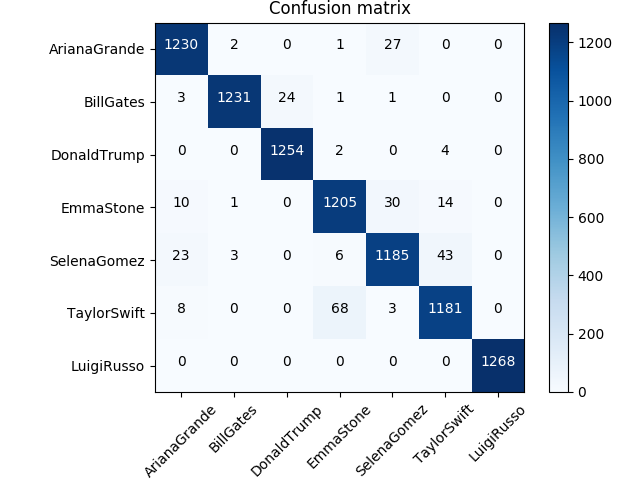

# Am I a celebrity?
The ironic title is an excuse to introduce a problem and show the results.
As can be seen from the title, in this problem, we want to address a very important target in the field of computer vision and artificial intelligence: Visual Recognition.
The main idea is based on a set of data (people's faces) and recognize their face.
The resolution of the task, features a set of Celebrity images data set (The best way to obtain images easily available from the internet).
The dataset was obtained through youtube videos for each celebrity. The celebrities in question are 6: ArianaGrande, Bill Gates, Donald Trump, Selena Gomez, Taylor Swift, Emma Stome and Luigi Russo (myself).

## Preprocessing
The preprocessing phase was very important in order to obtain a valid image dataset.
The images were obtained from videos taken from youtube, where each video was represented by a celebrity. Generally the videos taken referred to interviews in order to give more emphasis to the structure of the video.
For each video, the following steps were performed:
1) Each Video: TaylorSwift.mp4 consisting of 10/15 min has been converted into frames of images, so as to obtain the i-th folder represented only by Taylor images. And so on..
2) After obtaining the 6 classes, where each class is represented by N images, a boundingbox algorithm has been applied to each folder.
The BoundingBox algorithm is like a function where given an image with a face, it must output only the face.
The bounding box algorithm was performed for each folder in order to obtain another folder with all the extractions of the faces.

## Neural Network Model

The neural network model I wanted to use is an Odenet Neural Network. For this Task, however, I also wanted to use a small block of resnet before the ReteNeurale Odenet.
The Odenet neural network, recently in the field of artificial intelligence and in particular as features extraction, has obtained excellent results expressed in terms of validation accuracy and training accuracy.

## Dataset

As mentioned above, the image dataset was obtained from videos taken from Youtube for each celebrity.
The training was therefore performed on data sets represented by images and the latter were divided into 70% training images and 30% test images.
The training images are 2940 and the test images are 1260.

Frames             |  Face (BoundingBox)
:-------------------------:|:-------------------------:
   |    
 
## Libraries
The main libraries for ML application used for this project are: 
1) Tensorflow 1.4
2) Keras 2.1.2
3) H5PY 2.8

## How to Use

As described previously the first step is building the dataset. The dataset rappresented by images has been obtained by video. 
Let's suppose to download video: TaylorSwift interview and making the video in respectly folder.
```
mkdir VideoDataset
```
The second Step, run the Python Script: 

```
python extract_frames.py
```
This script allow to obtain frames for each video and place pictures obtained in a new folder. 
For example: given a path that contains video: C:/.../.../VideoDataset
the script will split the name video "taylorSwift.mp4" in "taylorSwift" and create a folder with same name. Succefully the script will save in while success the frames in the folder taylorswift and so on for the rest of videos. 

This fase will be followed by another script: crop faces. This faces will make a bounding box of each frames places in each folder previously cited. 
In this case will be run: 
```
python crop.py
```
The crop function will apply the p viola and m jones algorithm for obtain only faces. The script needs the path of each folder that contains frames and it will making another folder with cropped faces. 

After this step we will obtain N folder, where for each folder contains copped faces. It will be necessary split the folder in train set and test set (70% and 30%). 

At the end, it will be possible run the training. The first time it will be necessary save the images in the numpy array or h5df. 

```python
path_data_train = 'dataset_costruito_me/train'
X_train,Y_train = get_data(path_data_train)

path_data_test = 'dataset_costruito_me/test'
X_test,Y_test = get_data(path_data_test)
```
After that, it will necessary save x_train, y_train, x_test and y_test: 
```python
f = h5py.File('X_train_my.hdf5', 'w')
X_train = f.create_dataset("train_X", data=X_train)

f = h5py.File('Y_train_my.hdf5', 'w')
Y_train = f.create_dataset("train_Y", data=Y_train)

f = h5py.File('X_test_my.hdf5', 'w')
X_test = f.create_dataset("test_X", data=X_test)
f = h5py.File('Y_test_my.hdf5', 'w')
Y_test = f.create_dataset("test_Y", data=Y_test)
```

After that it will possibile to read data from .hdf5 files withot read every time from the path. 

Run the training:


```
python training_odenet_nn.py
```

## Results
The results obtained are very interesting using a odenet neural network: 
1) Val Accuracy: 0.97
2) Val Loss: 0.17

Results | #Precision | #Recall | #f1-score | #support 
--- | --- | --- | --- |--- 
ArianaGrande | 1.00 | 0.98 | 0.99 | 1260
BillGates | 1.00 | 0.86 | 0.92 | 1260
DonaldTrump | 0.99 | 1.00 | 1.00 | 1260
EmmaStone | 0.97 | 0.97 | 0.97 | 1260
SelenaGomez | 0.92 | 0.99 | 0.96 | 1260
TaylorSwift | 0.97 | 0.97 | 0.97 | 1260
LuigiRusso | 0.93 | 1.00 | 0.97 | 1260




## Evaluation 

The evaluation test consists to load the model (detection_person_model.h5) obtained from training and try to recognize images never seen before from the neural network. This phase will be computed by NN in the followed step: 
1) WebCam of pc will be turned on 
2) The SW will take some pictures and save it in homedir. 
3) The SW will load the pictures and supply them to the trained neural network model.
4) Output served